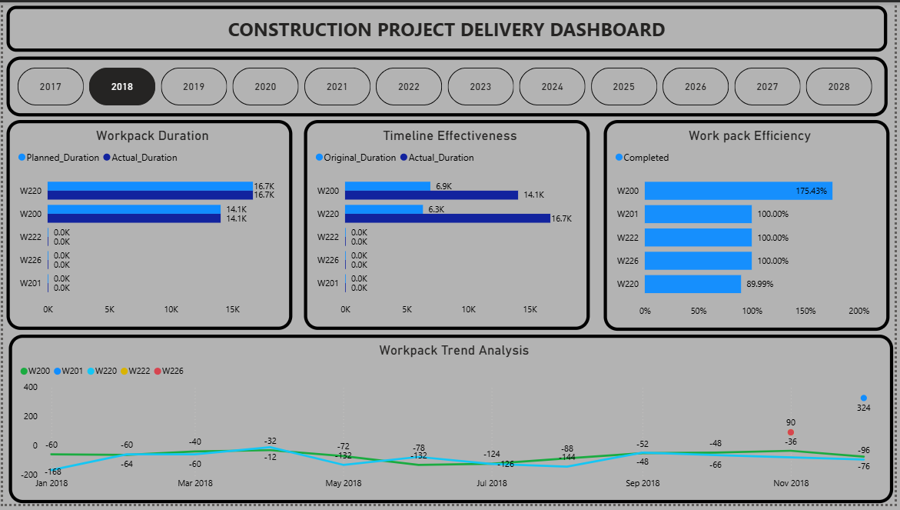
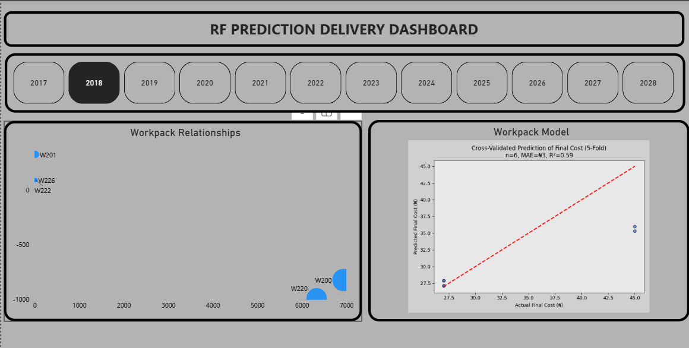
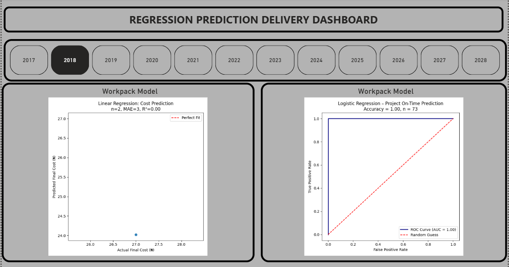
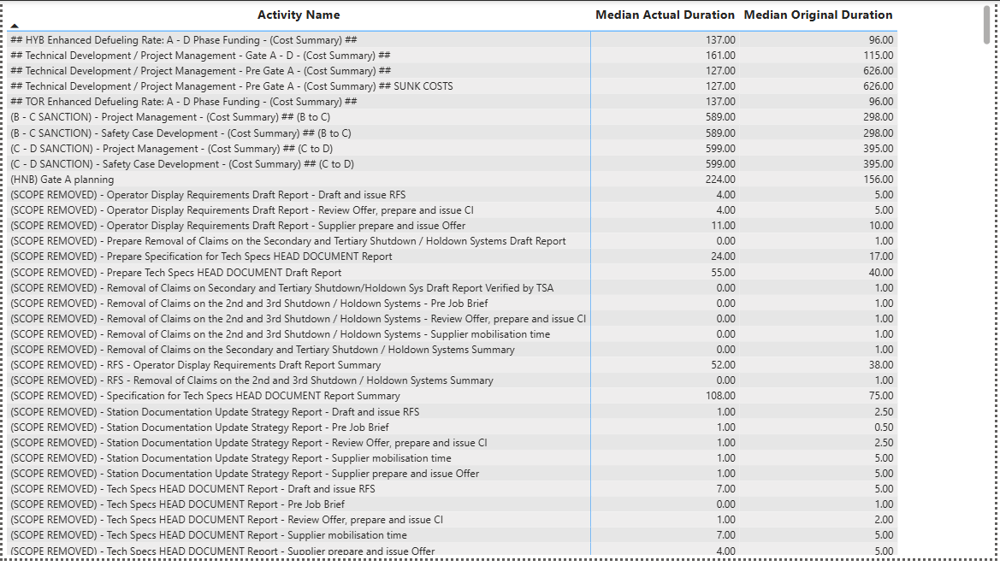

# Construction Project Delivery: Predictive Analysis

**Tool:** Power BI (dashboards) + Python (scikit-learn models embedded via Python visuals)
**Data:** Primavera P6-style activity and workpack schedule/cost data, tracked by Work Breakdown Structure (workpacks W200, W201, W220, W222, W226) across 2017–2028

## Overview

Most project-delivery dashboards stop at "are we on schedule?" This one goes a step further, layering two predictive models (Random Forest and Regression) on top of the delivery data to ask "can we forecast final cost and on-time completion before the project closes?" It's built across three connected report pages — a delivery-tracking dashboard, then two model-diagnostic pages — sitting on top of raw Primavera-style activity data.

---

## 🔍 The headline finding: rebaselining is hiding the true schedule slippage

This is the single most important thing in the workbook, and it's worth stating clearly before anything else.

The delivery dashboard tracks **two different duration baselines** side by side:
- **Workpack Duration** chart: Planned vs. Actual — for both active workpacks, these numbers match almost exactly (W220: 16.7K planned vs. 16.7K actual; W200: 14.1K planned vs. 14.1K actual).
- **Timeline Effectiveness** chart: Original vs. Actual — for the same two workpacks, the gap is enormous (W200: 6.9K original → 14.1K actual, a **104% overrun**; W220: 6.3K original → 16.7K actual, a **165% overrun**).

Read on their own, the first chart looks like the project is running almost perfectly to plan. It isn't — the "Planned" figure has clearly been revised over time to track wherever "Actual" ends up, while "Original" preserves the baseline set at project initiation. **This is a textbook project-controls red flag**: if leadership is only looking at Planned-vs-Actual, they're seeing a project that looks healthy; the Original-vs-Actual view tells the real story of workpacks running more than double their intended duration. Any executive summary built from this data should lead with the Original baseline, not the re-planned one.

---

## Page 1: Construction Project Delivery Dashboard

**Workpack Duration** (Planned vs. Actual, filterable by year 2017–2028) — see the rebaselining finding above.

**Timeline Effectiveness** (Original vs. Actual) — the true baseline comparison, showing W200 and W220 both running well over double their originally scoped duration.

**Work Pack Efficiency** (% Completed) — W200 sits at **175.43%**, W201/W222/W226 at exactly 100%, and W220 at 89.99%.
*Insight:* A completion rate above 100% is unusual and worth investigating before this is published — it typically means either scope was added mid-project (and the completion metric wasn't recalculated against the new scope) or there's a rebaselining artifact similar to the Duration chart above.

**Workpack Trend Analysis** (monthly schedule variance, Jan–Nov 2018) — most workpacks track in a fairly tight negative band (roughly −12 to −168 days, i.e., consistently behind schedule) for most of the year, then two workpacks spike sharply in November: W226 jumps to +90 and W200 jumps to +324.
*Insight:* That late-year spike is a genuine inflection point worth a narrative explanation in any presentation of this dashboard — whether it reflects a real schedule recovery, a project closeout adjustment, or a reporting anomaly changes what story this chart tells.

---

## Page 2: RF Prediction Delivery Dashboard

**Workpack Relationships** — a bubble chart positioning each workpack by its scale/relationship metrics; W200 and W220 stand out as the largest, most active workpacks, consistent with them being the only two with non-zero activity in the delivery dashboard.

**Workpack Model — Random Forest** (5-fold cross-validated prediction of Final Cost): **n = 6, MAE = ₦3, R² = 0.59**.
*Insight:* An R² of 0.59 means the model explains just under 60% of the variation in final cost — a genuinely promising signal for a first-pass model. The honest caveat to state alongside it: with only 6 workpacks in the training data, this result should be read as a proof of concept rather than a production-ready forecast. The natural next step for this project is expanding the training set to more historical workpacks/projects to see if that R² holds up.

---

## Page 3: Regression Prediction Delivery Dashboard

**Linear Regression — Cost Prediction:** n = 2, MAE = 3, R² = 0.00.
*Insight:* With only two data points, R² isn't a meaningful statistic — there's no real pattern to fit yet. Worth including transparently (rather than hiding a weak result) since it accurately documents where the modeling work currently stands, but this one isn't ready to inform any real decision.

**Logistic Regression — Project On-Time Prediction:** Accuracy = 1.00, n = 73, ROC AUC = 1.00.
*Insight:* This is the one result in the whole project worth double-checking before presenting it as a finished result. Perfect accuracy and a perfect AUC on 73 samples is an unusually strong outcome — in practice, that pattern most often means either the evaluation was run on the same data the model was trained on (rather than a held-out test set), or one of the input features is indirectly leaking the outcome (e.g., a field that's only populated once a project is already known to be on time). Worth re-running with a proper train/test split or k-fold cross-validation to confirm the result holds before relying on it.

---

## Underlying Data: Activity-Level Schedule Detail

The dashboards roll up from activity-level Primavera P6 data — individual line items (planning gates, cost summaries, safety case development, documentation milestones) each with a Median Actual and Median Original Duration, grouped under the workpacks shown above.

*Data quality note:* a number of activities are tagged **"(SCOPE REMOVED)"** — these show near-zero Actual Duration against a non-zero Original Duration, since the work was cancelled rather than completed. Left unfiltered, these activities would understate overrun rates and inflate completion percentages elsewhere in the dashboard (a possible contributor to the >100% Work Pack Efficiency figure on Page 1). Recommend excluding or separately flagging "(SCOPE REMOVED)" activities in any aggregate overrun calculation.

---

## Key Takeaways

1. **Report against the Original baseline, not the re-planned one.** The Planned-vs-Actual view currently makes the project look on track; the Original-vs-Actual view shows overruns of 100–165%.
2. **The predictive layer is a promising start, not a finished product.** The Random Forest cost model (R²=0.59, n=6) is worth building on with more data; the two regression models (n=2, and a suspiciously perfect n=73 classifier) both need more rigorous validation before being trusted.
3. **Clean the "(SCOPE REMOVED)" activities out of completion-rate calculations** — they're currently a likely source of the >100% efficiency figure.
4. **The November schedule-variance spike deserves a one-line explanation** wherever this dashboard gets presented, since it's the most visually striking point on the whole page.

## Methodology Note

The Random Forest, Linear Regression, and Logistic Regression diagnostics were built in Python (scikit-learn) and embedded into Power BI via Python visuals — worth stating explicitly in the published version, since it's a nice signal of the mixed Power BI + Python skill set this project demonstrates.
